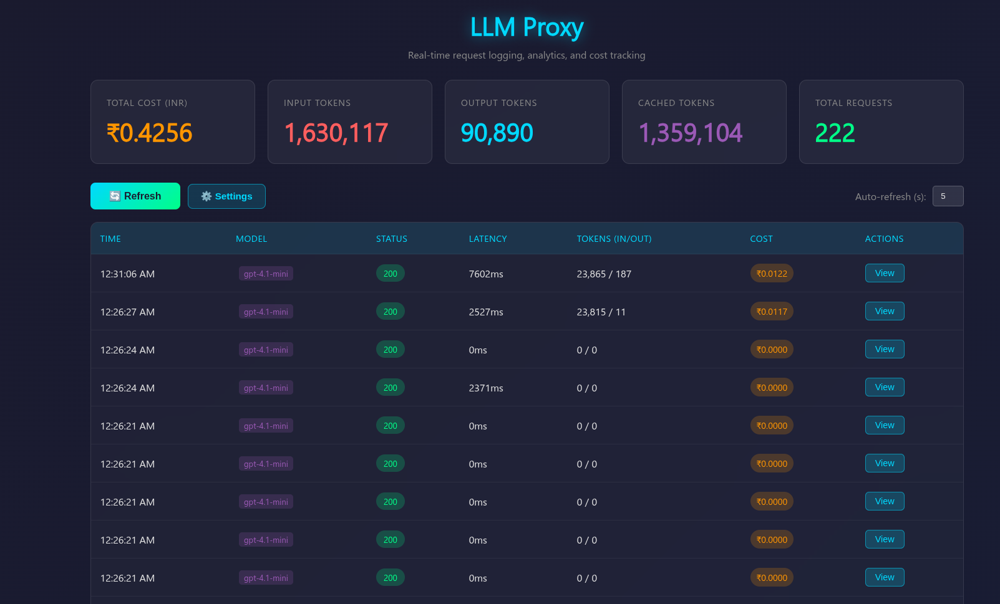

# llmproxy

I built this because I wanted to see exactly what my agents (mostly Hermes) were doing and how much it was costing me. It's a dead-simple Go proxy that sits between your agent and whatever LLM API you're using.

It catches every request, logs the full body, tracks token usage, and calculates the cost in real-time.



## why?

- **Visibility:** Agents can be black boxes. This lets you see the raw prompt and response for every single call.
- **Cost Tracking:** It calculates spend based on actual token usage (including cached tokens).
- **Rate Limiting:** Keeps things under control so an agent doesn't go rogue and burn through your credits (default is 60 req/min).
- **Hermes Integration:** I use this as the intermediary for Hermes to keep a pulse on usage.

## features

- **SQLite Backend:** All logs are stored locally in `tracer.db`.
- **Live Dashboard:** A simple HTML dashboard to view logs and stats.
- **Model Mapping:** Automatically forces requests to use a specific model defined in your config.
- **OpenAI Compatible:** Works with any provider that follows the OpenAI API format (and some others like Ollama).

## setup

1.  Clone this repo.
2.  Create a `.env` file from the `.env.example`.
3.  Set your environment variables:
    - `API_BASE`: The upstream API URL. **Important:** Include the `/v1` part here (e.g., `https://api.openai.com/v1`).
    - `API_KEY`: Your actual provider API key.
    - `MODEL`: The model you want to force all requests to use.
4.  Build and run it:
    ```bash
    go build -o llmproxy main.go
    ./llmproxy -host 0.0.0.0 -port 8080 -pricing pricing.json
    ```
5.  Point your agent's base URL to `http://localhost:8080`. You don't need to add `/v1` in your agent's config—the proxy handles that mapping. Just use the root address.

## configuration

You can configure the proxy via command line flags:
- `-host`: The host to listen on (default: `0.0.0.0`)
- `-port`: The port to listen on (default: `8080`)
- `-rpm`: Maximum requests per minute (default: `60`)
- `-pricing`: Path to a JSON file containing model pricing (default: `pricing.json`)

### pricing.json format
The pricing file should be a JSON map where keys are model names (or prefixes) and values are prices per **1 million tokens** in USD.
```json
{
  "gpt-4o": {
    "InputPrice": 5.00,
    "CachedPrice": 2.50,
    "OutputPrice": 15.00
  }
}
```

## deployment

If you want to run this as a systemd user service (no sudo required):
1.  Edit `llmproxy.service` and update the `WorkingDirectory` and `ExecStart` paths to match where you cloned the repo.
2.  Create the user systemd directory if it doesn't exist: `mkdir -p ~/.config/systemd/user/`
3.  Copy the file: `cp llmproxy.service ~/.config/systemd/user/`
4.  Reload and start: 
    ```bash
    systemctl --user daemon-reload
    systemctl --user enable --now llmproxy
    ```
5.  Check status: `systemctl --user status llmproxy`


## usage

- **Proxy:** `http://localhost:8080`
- **Dashboard:** `http://localhost:8080/dashboard`
- **Stats API:** `http://localhost:8080/api/stats`
- **Logs API:** `http://localhost:8080/api/logs`

## todo

- Add more pricing data for different models.
- Export logs to CSV/JSON.

## technical details

This is a lightweight reverse proxy written in Go. Here is how it works:

- **Request Handling**: It intercepts incoming HTTP requests, clones the body, and forwards them to the upstream provider.
- **Dynamic Rewriting**: It enforces the `MODEL` from your `.env` on every request and injects `include_usage` for streaming requests to ensure token counts are captured.
- **Local Metadata**: It provides local responses for `/models`, `/api/tags`, and `/version` so that tools think they are talking to a native service.
- **Token Extraction**: It parses standard JSON responses and Server-Sent Events (SSE) to extract `input_tokens`, `output_tokens`, and `cached_tokens`.
- **Database**: Logs are stored in a local SQLite database (`tracer.db`). Latency is measured from the proxy's perspective.
- **Pricing**: Costs are calculated per 1M tokens with a prefix-based fallback for model names.
